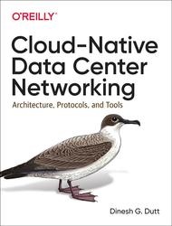
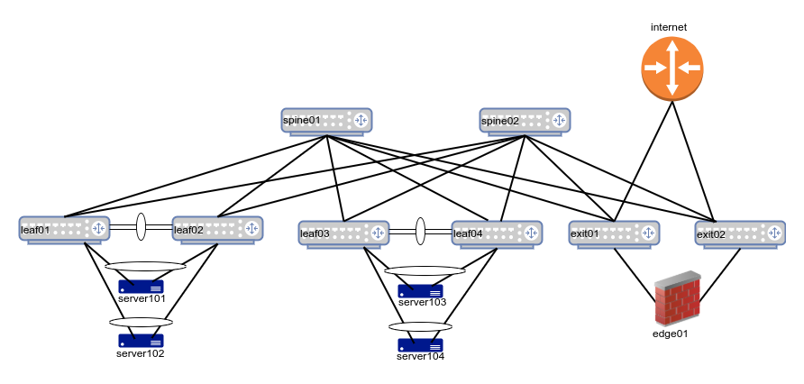

# Cloud Native Data Center Networking
Code repository for the O'Reilly book 'Cloud Native Data Center Networking'. You can get the book either via [Safari](https://learning.oreilly.com/library/view/cloud-native-data/9781492045595/) or an online bookseller such as [Amazon](https://www.amazon.com/Cloud-Native-Data-Center-Networking-Architecture/dp/1492045608/).

The github repo is not fully done yet, though a large portion of it is operational. I discuss what is working and what is not towards the end of this README.

All my code has been tested on a Ubuntu laptop running either 18.04 or 19.04. If you experience an issue, please file a ticket and I'll do what I can to help, no promises. If you send me a fix via a [pull request](https://help.github.com/en/github/collaborating-with-issues-and-pull-requests/creating-a-pull-request), I'll be grateful and incorporate the fix as quickly as I can.

## Software Used

| Software          | Version |
|-------------------|---------|
|[Vagrant](https://www.vagrantup.com/)| 2.2.5|
|[vagrant-libvirt](https://github.com/vagrant-libvirt/vagrant-libvirt)|
|[Virtualbox](https://www.virtualbox.org/)| 6.0.6 |
|[Ansible](https://www.ansible.com/)| 2.8.4 |
|[FRRouting](https://frrouting.org/)| 7.2 & version in Cumulus 3.7.x|

The vagrant-libvirt link contains instructions on installing libvirt, QEMU and KVM for various Linux distributions. I use libvirt because it spins up VMs in parallel, making the entire setup a breeze on most modern laptops. For example, on my Lenovo Yoga 920 with an i7-8550U processor and 16GB RAM running Ubuntu 19.04, I can spin up all of the different simulations (using Cumulus rather than Arista) in less than two minutes, and still have a functioning laptop i.e. I'm browsing, editing code etc. Virtualbox is more universally supported such as on Windows and Macs, but is much slower. Remember to use the Vagrant-vbox file to spin up the simulation using Virtualbox. 

Even though I tested using Virtualbox 6.0.6, the virtualbox images for Cumulus VX have been built with Virtualbox Guest Additions for 5.1.8. That did not pose a problem for my testing and I don't use shared folders.

### Vagrant Boxes Used

Vagrant uses VM images called boxes for spinning up the VMs. I use Vagrant boxes that should automatically download the appropriate Vagrant box when you run `vagrant up`. If that doesn't happen, you'll need to download the Vagrant box manually. Some Vagrant boxes such as Arista's needs to be downloaded from their website. You can spin up a libvirt image of Arista's VM using the instructions on this [link](https://codingpackets.com/blog/arista-veos-vagrant-libvirt-box-install).

The Vagrant boxes used in the simulation include:

| Vagrant Box                       | Version     |
|-----------------------------------|-------------|
| CumulusCommunity/cumulus-vx       | > 3.6, < 4.0|
| generic/ubuntu1604                | latest      |

I use Ubuntu 16.04 because the playbooks haven't been migrated to use Netplan, the method to configure network interfaces, used in releases starting with Ubuntu 18.04. I also use the specific Ubuntu boxes as they support libvirt images. In many cases, you can convert a Vagrant virtualbox image into a libvirt image via the Vagrant plugin, [vagrant-mutate](https://github.com/sciurus/vagrant-mutate). The docker-ce Ubuntu box removes the need to install Docker. But you can use any other Ubuntu 1604 image that is supported by libvirt, if you wish. If you choose to use a different Ubuntu image than generic/ubuntu1604, then remember to change the name at the top of your Vagrantfile.

## Repository Organization

There are three main scenarios (each with its own set of subscenarios) that warrant a full and separate simulation. The three scenarios are:

1. Deploying OSPF in a 2-tier Clos topology. This is described in chapter 13 of the book. This has the following additional subscenarios:
   1. Traditional Numbered OSPF
   2. Unnumbered OSPF
   3. OSPF running on the host with containers

2. Deploying BGP in a 2-tier Clos topology. This is described in chapter 15 of the book, and has the following additional subscenarios:
   1. Traditional Numbered BGP
   2. Unnumbered BGP
   3. BGP running on the host with containers

3. Deploying EVPN with VXLAN. This is described in chapter 17 of the book. It too has additional subscenarios which are:
   1. Centralized Routing with eBGP
   2. Distributed Routing with eBGP
   3. OSPF + iBGP with Distributed Routing
   
Each of these scenarios also has validation playbooks as described in chapter 18. Those validation playbooks have been embedded inside each of the appropriate scenarios. 

**The topologies used in this github differ from the ones used in the deployment chapters in the book**. They've been simplified and expanded. Simplified by reducing the number of servers to enable the simulation to run on a 16GB RAM laptop. Expanded by using a generic single attach and a dual-attach topology for all scenarios described in the book. But, I've stayed true to the IP addresses and ASNs used in the book. Only in the case of EVPN have the servers under each pair of switches been put in different VLANs to demonstrate multiple VNIs. I've also stayed true to the interface names used in the book and in this repository. Thus, the configuration files should look mostly alike.

Singly attached servers is common in larger networks while dual-attached servers is common in enterprise and smaller networks.

The dual-attached server topology used across all the scenarios looks like this:

The singly-attached server topology used across all the scenarios looks like this:

In the singly-attached servers topology, the peerlinks between the leaves exist, but are not used and CLAG is not configured.

## Starting/Stopping the Topology

`vagrant` doesn't take a filename as an option and so depending on the hypervisor you're choosing - KVM/libvirt or Virtualbox - you must copy the appropriate Vagrantfile to Vagrantfile. Thus, if you're using KVM, copy Vagrantfile-kvm to Vagrantfile.

Once you've the file called `Vagrantfile`, you start the topology with `vagrant up`. If you want to spin up only a subset of the nodes, you can do so by specifying the nodes you want to spin up. For example, if you wish to spin up the network with just the leaves and spines without the servers and edges, you can do so using `vagrant up spine01 spine02 leaf01 leaf02 leaf03 leaf04`. The playbooks should all run with the limited topology too, but you'll see errors (only once) for the nodes that cannot be found.

To destroy the topology, you run `vagrant destroy -f`. To destroy a subset of nodes, you specify the node names to destroy. For example, run `vagrant destroy -f leaf03 leaf04` to destroy only the nodes leaf03 and leaf04. 

## Running the Playbooks

We use Ansible to run the playbooks. After starting the topology, go to the appropriate playbook directory: ospf, bgp or evpn. In that directory, you can deploy the configuration via the command `ansible-playbook -b deploy.yml`.
You can switch between subscenarios by running the `reset.yml` playbook within each of the scenarios before running the `deploy.yml` playbook. 

The names of the three scenarios supported by ospf and bgp are: numbered, unnumbered, docker. The first configures the switches to run the numbered version of the protocol and the second, the unnumbered version. The third installs docker and FRR and is used to test routing on the host.

The `-b` option is to inform Ansible to execute the commands as root.

By default, the unnumbered version is run. To run any of the non-default versions, you must pass the name via an extra option when invoking `ansible-playbook`. For example, to run the numbered version, you'd run the playbook as: `ansible-playbook -b -e 'scenario=numbered' deploy.yml`.

The docker scenario takes longer to finish as it requires the installation of both docker and FRR on each server.

The playbooks for each of the scenarios uses Ansible as a dumb file copier. The code samples under the Ansible directory provides options for the dual attach topology and a single scenario with different levels of sophistication. 

A common way to test if the configuration is working correctly is to test reachability between servers and from the server to the internet. The internet facing router is provided with an address 172.16.253.1 that can be used to ping from the servers to check that the path is correctly plumbed all the way to the edge of the data center. Pinging from one server to another from reachability is also good.

As this book is vendor-neutral, with demonstrations and samples using specific vendors owing to my familiarity and the availability of Vagrant boxes, I've not followed the methodology of writing playbooks dictated by any vendor. I've tried to use the most easily understandable and open source code as much as possible. Specifically in the case of Cumulus, all FRR configuration is viewable as `/etc/frr/frr.conf`. All bridging (L2) and VXLAN configuration is under `/etc/network/interfaces` because FRR does not support any L2 or VXLAN configuration as of version 7.2. You can access FRR's shell via the `vtysh` command. vtysh provides network operators unfamiliar with Linux with a shell that's more familiar. Cumulus-familiar network operators can also use the NCLU commands available under the `net` family of commands.

### When to Ignore Errors in Running the Playbook

When you run the reset.yml playbook, the reload networking task on switches fails with a fatal UNREACHABLE error. Ignore this as this is caused by switching the eth0 interface from mgmt VRF to default VRF.

## What Scenarios Are Working and Tested

The status as of Nov 30, 2019 evening is as follows. 

The following dual-attached topologies are working:

* OSPF with all subscenarios. The exit, firewall and edge nodes are not configured in any of the subscenarios of each of these scenarios.

* BGP and EVPN all subscenarios. All nodes including exit, edge and firewall nodes are configured and working.

The following single-attached topologies are working:

* OSPF and BGP with all subscenarios. The exit, firewall and edge nodes are not configured in any of the subscenarios of each of these scenarios.

The remaining scenario and subscenarios are being worked on and should be up in the next few days. Validation playbooks, Playbooks illustrating better use of Ansible etc. are also not ready and will be added after adding support for the remaining scenarios and subscenarios.
